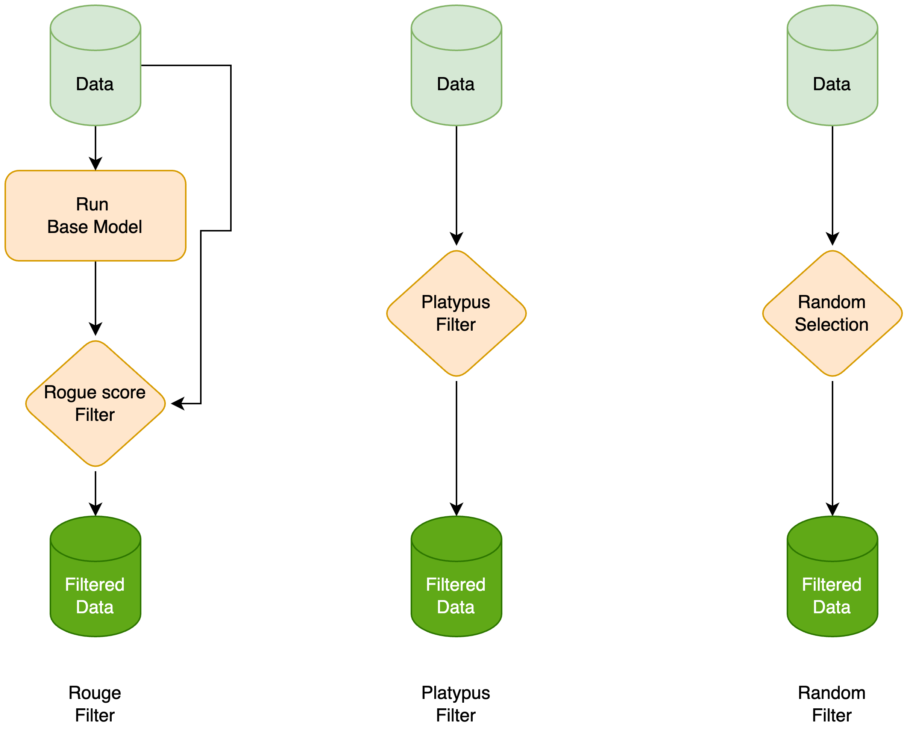
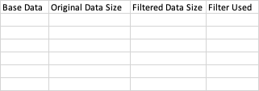

# Submission for NeurIPS LLM Efficiency Challenge:1 LLM + 1GPU + 1Day

## Base Model and Config
* We used mistral 7B (https://huggingface.co/mistralai/Mistral-7B-v0.1) as our base model
* 1x4090 GPU
* 4-bit QLoRA
* [Weights and Bias](https://wandb.ai/a-little-learner/Mistral-7B-ft-NIPS/runs/200k_RP_NIPS_pack_bs2x4_8192_2e-5_paged_adamw_32bit_qlora_r32_alph32_tgt-gate_p-down_p_up_p-drp0.05_ep3/overview?workspace=user-akjindal53244)

## Data Filters
We use three kind of filters
### Rouge Filter
1. We run the base model through open source train data, once we get the output we calculate rouge score with output and expected output.
2. With cutoff threshold we filter out the data points with high rouge score.
### Platypus Filter
We used platypus (https://arxiv.org/abs/2308.07317) based embedding filter with same data as in the paper, but we discarded the LLM generated data.
### Random Filter
We extracted random examples using this filter from some tasks.

Following table depicts our exact setting for the different model versions
###Submission 1

